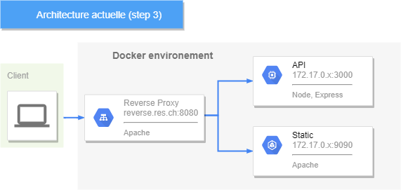
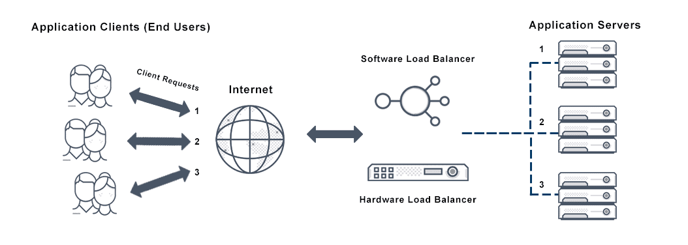
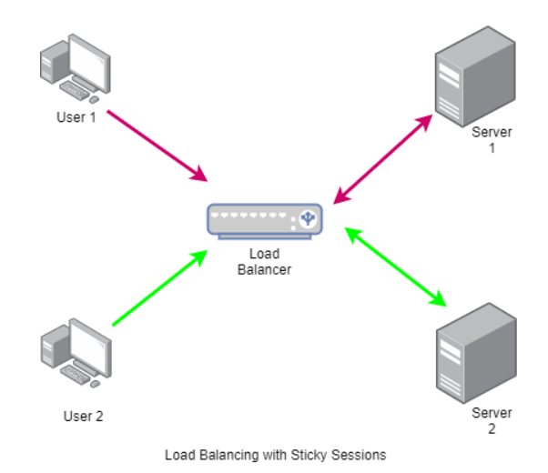

# RES 2021 - Infrastracture HTTP

> Par Alec Berney & Nicolas Crausaz

# Introduction

Ce laboratoire fait partie du cours RES-2021 de l'HEIG-VD.

Il permet de mettre en pratique l'utilisation de Docker et les interactions avec HTTP.

Les outils utilisés tout au long de ce laboratoire sont:

- Docker + WSL (Windows)
- Node.js v14.16
- php v7.4
- apache

# Step 1: Static HTTP server with apache httpd

Cette étape consiste à mettre en place un serveur apache et de modifier
le contenu servi par le serveur HTTP. Pour ce faire, nous avons créer une image Docker.

Nous avons récupéré un template issu du framework CSS [Bulma](https://bulma.io/).

## Docker

Notre image docker est construite sur la base d'une image php (v7.4) + apache, nous ajoutons simplement notre
site statique (src/) dans le dossier apache par défaut.

```dockerfile
FROM php:7.4-apache

COPY src/ /var/www/html/
```

Pour construire notre image et démarrer le container, il faut exécuter les commandes suivantes:

- `docker build -t res/static-apache ./step1`

- `docker run -d --name static_apache -p 9090:80 res/static-apache`

Notre site est ainsi accessible sur [http://localhost:9090/](http://localhost:9090/)

# Step 2: Dynamic HTTP server with express.js

Cette application prédit votre note dans des unités d'enseignement de l'HEIG-VD. Il s'agit d'une application Node.js avec le module express.js, permettant de construire des API HTTP. 

## Docker

Notre image docker est construite sur la base d'une image Node.js (v14.16).

Nous copions le contenu de notre application vers notre container (/opt/app), puis démarrons notre application node.

```dockerfile
FROM node:14.16

COPY src/ /opt/app

CMD ["node", "/opt/app/app.js"]
```

Pour mettre en place cette application, il faut exécuter les commandes suivantes:

- `cd step2/src`

- `npm install`

- `cd ..`

- `docker build -t res/node-express .`

- `docker run -d --name express_dynamic -p 8282:3000 res/node-express`

Notre API est maintenant accessible sur sur [http://localhost:8282/](http://localhost:8282/).

## Utilisation

Cette API dispose de 4 routes:

- [http://localhost:8282/](http://localhost:8282/)

   Une requête HTTP sur cette URL retournera un simple message texte:

   ```
   Hello, this is the main endpoint
   ```

- [http://localhost:8282/grades](http://localhost:8282/grades)

   Une requête HTTP sur cette URL retournera la liste de toutes les unités
   avec une note aléatoire pour chacune de celles-ci.

   ```json
   [
      {"unit":"RES", "grade":5},
      {"unit":"PCO", "grade":6},
      {"unit":"ASD", "grade":1},
      {"unit":"ISD", "grade":4},
      {"unit":"MAT1", "grade":1},
      ...
      {"unit":"TIB", "grade":4}
   ]
   ```


- [http://localhost:8282/grade/res](http://localhost:8282/grade/res)

   Une requête HTTP sur cette URL retournera une note pour l'unité passée en paramètre, la liste des unités disponibles se trouve [ici](./step2/src/data/units.js).

   ```json
   {
      "unit":"RES",
      "grade":6
   }
   ```

- [http://localhost:8282/one](http://localhost:8282/one)

    Une requête HTTP sur cette URL retournera une note pour une unité aléatoire.

   ```json
   {
      "unit":"SYE",
      "grade":6
   }
   ```

# Step 3: Reverse proxy with apache (static configuration)

Cette étape consite à mettre en place un reverse proxy avec apache, en utilisant une configuration statique.

Nous avons créer un vHost faisant office de reverse proxy, il est chargé de rediriger une requête HTTP vers le bon serveur en fonction de l'URL de cette requête.

Dans cette étape la configuration est faite de manière statique, ce qui n'est pas optimal car on doit reconfigurer nos fichiers de configuration et reconstruire notre image si les adresses IP de nos containers ont changer.

Notre configuration est donc:

```
<VirtualHost *:80>
   ServerName reverse.res.ch

   # Routes for api requests (random grades)
   ProxyPass "/api/" "http://172.17.0.2:3000/"
   ProxyPassReverse "/api/" "http://172.17.0.2:3000/"

   # Routes for static website
   ProxyPass "/" "http://172.17.0.3:80/"
   ProxyPassReverse "/" "http://172.17.0.3:80/"

</VirtualHost>
```

Pour que cette configuration fonctionne, il faut ajouter une entrée DNS dans le fichier HOST de la machine
ici, nous avons ajouté:

`localhost reverse.res.ch`

Il faut également démarrer les containers dans le bon ordre:

- `docker run -d --name static_apache -p 9090:80 res/static-apache`

- `docker run -d --name express_dynamic -p 8282:3000 res/node-express`

- `docker build -t res/reverseproxy .`

- `docker run -d -p 8080:80 --name reverse_proxy  res/reverseproxy`


Notre reverse proxy est désormais fonctionnel, on peut accéder au site statique apache: [http://reverse.res.ch:8080](http://reverse.res.ch:8080)
ainsi qu'a l'API express [http://reverse.res.ch:8080/api/grades](http://reverse.res.ch:8080/api/grades)

Cette configuration actuelle est très contraignante car nous devons être sûr que les bonnes addresses IP des containers sont spécifiées
dans la configuration apache du reverse proxy.

Voici l'état actuel de notre infrastructure 



## Docker

Notre image docker est construite sur la base d'une image php (v7.4) + apache, nous ajoutons nos fichiers de configuration (vHosts) dans le dossier sites-available de apache.

Nous activons le module apache proxy et proxy_http grâce à la commande `a2enmod`, puis actions nos hôtes virtuels grâce à la commande `a2ensite`.

```dockerfile
FROM php:7.4-apache

COPY conf/ /etc/apache2

RUN a2enmod proxy proxy_http
RUN a2ensite 000-* 001-*
```

# Step 4: AJAX requests

Pour cette étape, il s'agit de se familiariser avec les requêtes AJAX (Asynchronous JavaScript and XML).
Pour se faire nous avons utilisé l'API native javascript *fetch*.

Nous avons modifié notre image du step1 pour y ajouter des requêtes AJAX sur notre application du step2 (Express.js).

Le site statique récupère des notes aléatoires à intervalle de 3 secondes et les affiches sous forme de tableau.

## Docker

Notre image est la même qu'au step1, nous avons simplement installer vim pour modifier notre site directement sur le container.

```dockerfile
FROM php:7.4-apache

RUN apt-get update && apt-get install -y vim

COPY src/ /var/www/html/
```

Notre container peut être démarré de cette manière:

- `docker build -t res/static-ajax ./step4`

- `docker run -d --name static_ajax -p 9090:80 res/static-ajax`

Pour que les requêtes vers l'API soient fonctionnelle, il accéder au site par le reverse proxy [http://reverse.res.ch:8080](http://reverse.res.ch:8080).
Ceci est du à la Policy _Same-origin_ qui restreint la manière dont les ressources peuvent être chargées depuis une origine, vers une origine différente.

Dans notre cas, si l'on utilise pas le reverse proxy, on aurait notre site statique sur localhost:9090 et notre API sur localhost:8282.
Ces deux origines sont considérées comme différentes, de ce fait notre site ne pourra pas effectuer de requêtes vers l'API.

Il y a deux solution pour contourner cette policy:

- Utiliser un *reverse proxy*, ce qui fera que les deux sites soient dans la même _origin_. C'est la solution choisie ici.

- Mettre en place la validation *CORS* (Cross-origin resource sharing) au niveau du serveur HTTP (express), ce qui permettra de partager des 
ressources entre plusieurs origines.

TODO: Inserer une capture des notes

# Step 5: Dynamic reverse proxy configuration

L'objectif de cette étape est d'améliorer notre reverse proxy pour avoir une configuration dynamique, pour ne pas avoir à modifier
notre fichier de configuration apache.

## Docker

Nous avons modifié notre image du step3 pour ajouter quelques commandes:

```dockerfile
FROM php:7.4-apache

RUN apt-get update && apt-get install -y vim

COPY apache2-foreground /usr/local/bin/
COPY templates /var/apache2/templates
COPY conf/ /etc/apache2

RUN a2enmod proxy proxy_http
RUN a2ensite 000-* 001-*
```

Nous copions notre script php qui permet de générer dynamiquement notre fichier de configuration du reverse proxy.
Nous copions aussi le fichier _apache2-foreground_, il s'agit du script qui est exécuté lors de la construction de l'image source (php7.4),
nous avons utilisé ce fichier pour ajouter des variables d'environnement à notre container ($STATIC_APP et $DYNAMIC_APP).
Ces variables nous permettent de spécifier les adresses de nos deux services (site et API).

Il faut démarrer les containers sur step 2 et 4, puis démarrer notre reverse proxy dynamique:

- `docker build -t res/dynamic-proxy .`

- `docker run -e STATIC_APP=172.17.0.3:80 -e DYNAMIC_APP=172.17.0.2:3000 res/dynamic-proxy`

Pour tester le reverse proxy, il suffit de se rendre sur [http://reverse.res.ch:8080](http://reverse.res.ch:8080).
Le site doit fonctionner comme auparavant, c'est à dire mettre à jour la liste de note toutes les 3 secondes.

# Additional steps: Load balancing: multiple server nodes

Dans cette étape, nous ajoutons un système de load balancing sur notre reverse proxy dynamique (step 5).

Ceci nous permet d'avoir plusieurs containers pour chaque service (notre site statique et notre API), le reverse proxy ayant
désormais un rôle supplémentaire de load balancer, s'occupera de répartir les requêtes clients vers les différents _nodes_.

## Docker

Pour cette étape nous ré-utilisons la même image Docker, nous modifions seulement notre script PHP de génération de configuration apache,
il permet désormais d'avoir un nombre variable d'hôtes pour nos deux services. On spécifie nos hôtes par une liste d'addresses séparées par des virgules.
Pour démarrer le load balancing:

- `docker build -t res/load-balancing .`

- `docker run res/load-balancing`

- `docker run -e STATIC_APP=172.17.0.2:80,172.17.0.5:80,172.17.0.6:80 -e DYNAMIC_APP=172.17.0.3:3000,172.17.0.9:3000,172.17.0.10:3000 res/load-balancing`

La configuration résultante sera:

```conf
<VirtualHost *:80>
   ServerName reverse.res.ch

   # Routes for api requests (random grades)
   <Proxy 'balancer://dynamic_cluster'>
      BalancerMember "http://172.17.0.3:3000/"
      BalancerMember "http://172.17.0.9:3000/"
      BalancerMember "http://172.17.0.10:3000/"
	</Proxy>

   ProxyPass '/api/' 'balancer://dynamic_cluster'
   ProxyPassReverse '/api/' 'balancer://dynamic_cluster'

   # Routes for static website
   <Proxy 'balancer://static_cluster'>
      BalancerMember "http://172.17.0.2:80/"
      BalancerMember "http://172.17.0.5:80/"
      BalancerMember "http://172.17.0.6:80/"
	</Proxy>

   ProxyPass '/' 'balancer://static_cluster'
   ProxyPassReverse '/' 'balancer://static_cluster'
</VirtualHost>
```


# Additional steps: Load balancing: round-robin vs sticky sessions

*Round-Robin*: Le round-bin est, entre autre, un algorithme de load balancing, permettant
de répartir la charge (clients) entre les différents _nodes_ d'un _cluster_.

Le fonctionnement du round-robin est simple, il distribue séquentiellement les requêtes vers ses _nodes_, toujours
dans le même ordre:


<small>[source](https://avinetworks.com/glossary/round-robin-load-balancing/)</small>

*Sticky session*: Il arrive souvent que l'on doive conserver des informations entre les requêtes d'un même utilisateur (session).
On ne peut donc pas rediriger les requêtes d'un même utilisateur vers un autre _node_ car on perdrait des informations relatives à la session.

Le sticky session permet donc de d'envoyer toutes les requêtes d'un utilisateur spécifique vers le même _node_.



<small>[source](https://lakshitha-kasun.medium.com/load-balancing-and-sticky-sessions-in-clustering-c6f8d546a29c)</small>


Dans cette étape, nous allons effectuer une démonstration des sticky session.

Et démontrer le fonctionnement d'un load balancer round-robin.


## Docker

Pour le sticky session, nous utilisons le même Dockerfile qu'au step 5, nous modifions simplement notre script PHP pour ajouter les configuration relatives au sticky session, voici le résultat de configuration avec sticky sessions:

```conf
<VirtualHost *:80>
   ServerName reverse.res.ch

   # Routes for api requests (random grades)
   Header add Set-Cookie "ROUTEID=.%{BALANCER_WORKER_ROUTE}e; path=/" env=BALANCER_ROUTE_CHANGED
   <Proxy 'balancer://dynamic_cluster'>
      BalancerMember "http://172.17.0.3:3000/" route=1
      BalancerMember "http://172.17.0.9:3000/" route=2
      BalancerMember "http://172.17.0.10:3000/" route=3
      ProxySet stickysession=ROUTEID
	</Proxy>

   ProxyPass '/api/' 'balancer://dynamic_cluster'
   ProxyPassReverse '/api/' 'balancer://dynamic_cluster'

   # Routes for static website
   Header add Set-Cookie "ROUTEID=.%{BALANCER_WORKER_ROUTE}e; path=/" env=BALANCER_ROUTE_CHANGED
   <Proxy 'balancer://static_cluster'>
      BalancerMember "http://172.17.0.2:80/" route=1
      BalancerMember "http://172.17.0.5:80/" route=2
      BalancerMember "http://172.17.0.6:80/" route=3
      ProxySet stickysession=ROUTEID
	</Proxy>

   ProxyPass '/' 'balancer://static_cluster'
   ProxyPassReverse '/' 'balancer://static_cluster'
</VirtualHost>
```


# Additional steps: Dynamic cluster management

# Additional steps: Management UI