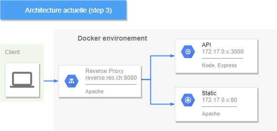

# RES 2021 - Infrastracture HTTP

> Par Alec Berney & Nicolas Crausaz

# Introduction

Ce laboratoire fait partie du cours RES-2021 de l'HEIG-VD.

Il permet de mettre en pratique l'utilisation de Docker et les interactions avec HTTP.

Les outils utilisés tout au long de ce laboratoire sont:

- Docker + WSL (Windows)
- Node.js v14.16
- php v7.4
- apache

*Le script [run_step.sh](./run_step.sh) à été réalisé afin de pouvoir déployer les étapes plus rapidement*, il s'utilise de la manière suivante:

- `.\run_step.sh <number>`, number = numéro de l'étape [1 à 9].

- `.\run_step.sh <number> --nobuild`, number = numéro de l'étape [1 à 9], permet d'omettre le build des images (utile pour gagner du temps si cela a déjà été fait)

- `.\run_step.sh purge`, permet d'éteindre tous les containers.

- `.\run_step.sh purge -rm`, permet d'éteindre & de supprimer tous les containers.

Il est recommandé de faire un `purge` entre chaque étape. 

</br>

# Step 1: Static HTTP server with apache httpd

Cette étape consiste à mettre en place un serveur apache et de modifier
le contenu servi par le serveur HTTP. Pour ce faire, nous avons créer une image Docker.

Nous avons récupéré un template issu du framework CSS [Bulma](https://bulma.io/).

## Docker

Notre image docker est construite sur la base d'une image php (v7.4) + apache, nous ajoutons simplement notre
site statique (src/) dans le dossier apache par défaut.

```dockerfile
FROM php:7.4-apache

COPY src/ /var/www/html/
```

Pour construire notre image et démarrer le container:

- `./run_step.sh 1`

Notre site est ainsi accessible sur [http://localhost:9090/](http://localhost:9090/)

</br>

# Step 2: Dynamic HTTP server with express.js

Cette application prédit vos notes dans des unités d'enseignement de l'HEIG-VD. Il s'agit d'une application Node.js avec le module express.js, permettant de construire des API HTTP. 

## Docker

Notre image docker est construite sur la base d'une image Node.js (v14.16).

Nous copions le contenu de notre application vers notre container (/opt/app), puis démarrons notre application node.

```dockerfile
FROM node:14.16

COPY src/ /opt/app

CMD ["node", "/opt/app/app.js"]
```

Pour mettre en place cette application:

- `./run_step.sh 2`

Notre API est maintenant accessible sur sur [http://localhost:8282/](http://localhost:8282/).

## Utilisation

Cette API dispose de 4 routes:

- [http://localhost:8282/](http://localhost:8282/)

   Une requête HTTP sur cette URL retournera un simple message texte:

   ```
   Hello, this is the main endpoint
   ```

- [http://localhost:8282/grades](http://localhost:8282/grades)

   Une requête HTTP sur cette URL retournera la liste de toutes les unités
   avec une note aléatoire pour chacune de celles-ci.

   ```json
   [
      {"unit":"RES", "grade":5},
      {"unit":"PCO", "grade":6},
      {"unit":"ASD", "grade":1},
      {"unit":"ISD", "grade":4},
      {"unit":"MAT1", "grade":1},
      ...
      {"unit":"TIB", "grade":4}
   ]
   ```


- [http://localhost:8282/grade/res](http://localhost:8282/grade/res)

   Une requête HTTP sur cette URL retournera une note pour l'unité passée en paramètre, la liste des unités disponibles se trouve [ici](./step2/src/data/units.js).

   ```json
   {
      "unit":"RES",
      "grade":6
   }
   ```

- [http://localhost:8282/one](http://localhost:8282/one)

    Une requête HTTP sur cette URL retournera une note pour une unité aléatoire.

   ```json
   {
      "unit":"SYE",
      "grade":6
   }
   ```

</br>

# Step 3: Reverse proxy with apache (static configuration)

Cette étape consiste à mettre en place un reverse proxy avec apache, en utilisant une configuration statique.

Nous avons créé un vHost faisant office de reverse proxy, il est chargé de rediriger une requête HTTP vers le bon serveur en fonction de l'URL de cette requête.
Ainsi, les serveurs internes n'ont pas besoin d'ouvrir des portes en externes.

Dans cette étape la configuration est faite de manière statique, ce qui n'est pas optimal car on doit reconfigurer nos fichiers de configuration et reconstruire notre image si les adresses IP de nos containers ont changés.

Notre configuration est donc:

```
<VirtualHost *:80>
   ServerName reverse.res.ch

   # Routes for api requests (random grades)
   ProxyPass "/api/" "http://172.17.0.2:3000/"
   ProxyPassReverse "/api/" "http://172.17.0.2:3000/"

   # Routes for static website
   ProxyPass "/" "http://172.17.0.3:80/"
   ProxyPassReverse "/" "http://172.17.0.3:80/"

</VirtualHost>
```

Pour que cette configuration fonctionne, il faut ajouter une entrée DNS dans le fichier HOST de la machine hôte.
Voici où est situé le fichier host sur les 3 OS les plus utilisés:
Windows 10 - `"C:\Windows\System32\drivers\etc\hosts"`
Linux - `"/etc/hosts"`
Mac OS X - `"/private/etc/hosts"`

Nous avons donc ajouté la ligne suivante au fichier HOST:

`localhost reverse.res.ch`

Pour démarrer l'infrastructure:

- `./run_step.sh 3`

Notre reverse proxy est désormais fonctionnel, on peut accéder au site statique apache: [http://reverse.res.ch:8080](http://reverse.res.ch:8080)
ainsi qu'a l'API express [http://reverse.res.ch:8080/api/grades](http://reverse.res.ch:8080/api/grades)

Cette configuration actuelle est très contraignante car nous devons être sûr que les bonnes addresses IP des containers soient spécifiées
dans la configuration apache du reverse proxy.

Voici l'état actuel de notre infrastructure 



## Docker

Notre image docker est construite sur la base d'une image php (v7.4) + apache, nous ajoutons nos fichiers de configuration (vHosts) dans le dossier sites-available de apache.

Nous activons le module apache proxy et proxy_http grâce à la commande `a2enmod`, puis actions nos hôtes virtuels grâce à la commande `a2ensite`.

```dockerfile
FROM php:7.4-apache

COPY conf/ /etc/apache2

RUN a2enmod proxy proxy_http
RUN a2ensite 000-* 001-*
```

</br>

# Step 4: AJAX requests

Pour cette étape, il s'agit de se familiariser avec les requêtes AJAX (Asynchronous JavaScript and XML).
Pour se faire nous avons utilisé l'API native javascript *fetch*.

Nous avons modifié notre image du step1 pour y ajouter des requêtes AJAX sur notre application du step2 (Express.js).

Le site statique récupère des notes aléatoires à intervalle de 3 secondes et les affiches sous forme de tableau:


## Docker

Notre image est la même qu'au step1, nous avons simplement installer vim pour pouvoir modifier notre site directement sur le container
et faciliter notre processus de développement.

```dockerfile
FROM php:7.4-apache

RUN apt-get update && apt-get install -y vim

COPY src/ /var/www/html/
```

Notre container peut être démarré de cette manière:

- `./run_step.sh 4`

Pour que les requêtes vers l'API soient fonctionnelles, il faut accéder au site par le reverse proxy [http://reverse.res.ch:8080](http://reverse.res.ch:8080).
Ceci est du à la Policy _Same-origin_ qui restreint la manière dont les ressources peuvent être chargées depuis une origine, vers une origine différente.

Dans notre cas, si l'on utilise pas le reverse proxy, on aurait notre site statique sur localhost:9090 et notre API sur localhost:8282.
Ces deux origines sont considérées comme différentes, de ce fait notre site ne pourrait pas effectuer de requêtes vers l'API.

Il y a deux solution pour contourner cette policy:

- Utiliser un *reverse proxy*, ainsi les deux sites seront de la même _origin_. C'est la solution choisie ici.

- Mettre en place la validation *CORS* (Cross-origin resource sharing) au niveau du serveur HTTP (API express), ce qui permettrait de partager des 
ressources entre plusieurs origines.

</br>

# Step 5: Dynamic reverse proxy configuration

L'objectif de cette étape est d'améliorer notre reverse proxy pour avoir une configuration dynamique, afin de ne pas avoir à modifier
notre fichier de configuration apache.

## Docker

Nous avons modifié notre image du step3 pour ajouter quelques commandes:

```dockerfile
FROM php:7.4-apache

RUN apt-get update && apt-get install -y vim

COPY apache2-foreground /usr/local/bin/
COPY templates /var/apache2/templates
COPY conf/ /etc/apache2

RUN a2enmod proxy proxy_http
RUN a2ensite 000-* 001-*
```

Nous copions notre script PHP qui permet de générer dynamiquement notre fichier de configuration du reverse proxy.
Nous copions aussi le fichier _apache2-foreground_, il s'agit du script qui est exécuté lors de la construction de l'image source (php7.4),
nous avons utilisé ce fichier pour ajouter des variables d'environnement à notre container ($STATIC_APP et $DYNAMIC_APP).
Ces variables nous permettent de spécifier les adresses de nos deux services (site et API).

Il faut démarrer notre reverse proxy dynamique:

- `./run_step.sh 5`

Pour tester le reverse proxy, il suffit de se rendre sur [http://reverse.res.ch:8080](http://reverse.res.ch:8080).
Le site doit fonctionner comme auparavant, c'est à dire mettre à jour la liste de note toutes les 3 secondes.

</br>

# Additional steps: Load balancing: multiple server nodes

Dans cette étape, nous ajoutons un système de load balancing sur notre reverse proxy dynamique (step 5).

Ceci nous permet d'avoir plusieurs containers pour chaque service (notre site statique et notre API), le reverse proxy ayant
désormais un rôle supplémentaire de load balancer, s'occupera de répartir les requêtes clients vers les différents _nodes_.

## Docker

Pour cette étape nous ré-utilisons la même image Docker, nous modifions seulement notre script PHP de génération de configuration apache,
il permet désormais d'avoir un nombre variable d'hôtes pour nos deux services. On spécifie nos hôtes par une liste d'addresses séparées par des virgules.
Voici un exemple de commande pour fournir tous les containers utilisés dans le cluster effectuant du load balancing:
`docker run -p 8080:80 -d -e STATIC_APP=172.17.0.6:80,172.17.0.7:80,172.17.0.8:80,172.17.0.5:80 -e DYNAMIC_APP=172.17.0.3:3000,172.17.0.4:3000,172.17.0.5:3000 res/dynamic-proxy`

Pour démarrer le load balancing:

- `./run_step.sh 6`

La configuration résultante sera par exemple:

```conf
<VirtualHost *:80>
   ServerName reverse.res.ch

   # Routes for api requests (random grades)
   <Proxy 'balancer://dynamic_cluster'>
      BalancerMember "http://172.17.0.3:3000/"
      BalancerMember "http://172.17.0.4:3000/"
      BalancerMember "http://172.17.0.5:3000/"
	</Proxy>

   # Routes for static website
   <Proxy 'balancer://static_cluster'>
      BalancerMember "http://172.17.0.6:80/"
      BalancerMember "http://172.17.0.7:80/"
      BalancerMember "http://172.17.0.8:80/"
	</Proxy>

   ProxyPass '/api/' 'balancer://dynamic_cluster/'
   ProxyPassReverse '/api/' 'balancer://dynamic_cluster/'

   ProxyPass '/' 'balancer://static_cluster/'
   ProxyPassReverse '/' 'balancer://static_cluster/'
</VirtualHost>
```

Pour tester le load balancing, une manière de faire est d'éteindre certains container pour voir qu'un autre serveur répondra
à la place de l'ancien. Notez qu'il faut parfois attendre un peu.

Pour tester cette étape, il suffit d'ouvrir [http://reverse.res.ch:8080](http://reverse.res.ch:8080), ouvrir les outils de 
développement -> Application -> Cookies. On voit cette fois que la valeur du cookie change à chaque requête.

Notez que pour cette étape, nous avons ajouté des éléments de configuration pour transmettre un cookie afin de pouvoir
démontrer visuellement le changement de _node_.

On peut également démontrer le fonctionnement par défaut du round-robin que nous verrons à l'étape suivante.
En effet le round robin est le fonctionnement du load balancing par défaut d'apache: à chaque requête, le client
recevra une réponse du node suivant l'ordre configuré.

On voit ici le changement de _node_ grâce au cookie, à chaque requête vers l'API:


</br>

# Additional steps: Load balancing: round-robin vs sticky sessions

*Round-Robin*: Le round-robin est, entre autre, un algorithme de load balancing, permettant
de répartir la charge (clients) entre les différents _nodes_ d'un _cluster_. C'est ce que nous avons mis en place
à l'étape précédente.
Le fonctionnement du round-robin est simple, il distribue séquentiellement les requêtes vers ses _nodes_, toujours
dans le même ordre:


<small>[source](https://avinetworks.com/glossary/round-robin-load-balancing/)</small>

*Sticky session*: Il arrive souvent que l'on doive conserver des informations entre les requêtes d'un même utilisateur (session).
Par exemple pour conserver un panier d'achat sur un E-commerce.
On ne peut donc pas rediriger les requêtes d'un même utilisateur vers un autre _node_ car on perdrait des informations relatives à la session.

Le sticky session permet donc d'envoyer toutes les requêtes d'un utilisateur spécifique vers le même _node_, ceci jusqu'à la fin de la session.

Le problème des sticky sessions est que si le node n'est plus atteignable, le client perdra sa session. Il faudrait donc idéalement répliquer
les sessions entre tous les _nodes_.

On configure les sticky session à l'aide d'un cookie qui transite entre le client et le serveur à chaque requête / réponse.
Notre load balancer lis ce cookie et sait vers quel _node_ il doit rediriger la requête.

Le cookie peut soit être générer par apache (ce qui est notre cas ici), ou être généré par une application (backend).


<small>[source](https://lakshitha-kasun.medium.com/load-balancing-and-sticky-sessions-in-clustering-c6f8d546a29c)</small>

Dans cette étape, nous allons effectuer la mise en place des sticky sessions.

## Docker

Pour le sticky session, nous utilisons le même Dockerfile qu'au step 6 (Load balancing: multiple server nodes), nous modifions simplement notre script PHP pour ajouter les configuration relatives au sticky session, voici le résultat d'une configuration avec sticky sessions:

```conf
<VirtualHost *:80>
   ServerName reverse.res.ch

   # Routes for api requests (random grades)
   Header add Set-Cookie "ROUTEID=.%{BALANCER_WORKER_ROUTE}e; path=/" env=BALANCER_ROUTE_CHANGED
   <Proxy 'balancer://dynamic_cluster'>
      BalancerMember "http://172.17.0.3:3000/" route=1
      BalancerMember "http://172.17.0.4:3000/" route=2
      BalancerMember "http://172.17.0.5:3000/" route=3
      ProxySet stickysession=ROUTEID
	</Proxy>

   # Routes for static website
   Header add Set-Cookie "ROUTEID=.%{BALANCER_WORKER_ROUTE}e; path=/" env=BALANCER_ROUTE_CHANGED
   <Proxy 'balancer://static_cluster'>
      BalancerMember "http://172.17.0.6:80/" route=1
      BalancerMember "http://172.17.0.7:80/" route=2
      BalancerMember "http://172.17.0.8:80/" route=3
      ProxySet stickysession=ROUTEID
	</Proxy>

   ProxyPass '/api/' 'balancer://dynamic_cluster/' stickysession=ROUTEID|jsessionid scolonpathdelim=On
   ProxyPassReverse '/api/' 'balancer://dynamic_cluster/'
   
   ProxyPass '/' 'balancer://static_cluster/' stickysession=ROUTEID|jsessionid scolonpathdelim=On
   ProxyPassReverse '/' 'balancer://static_cluster/'
</VirtualHost>
```

Pour démarrer le load balancing:
- `./run_step.sh 7`

Pour tester cette étape, il suffit d'ouvrir [http://reverse.res.ch:8080](http://reverse.res.ch:8080), ouvrir les outils de 
développement -> Application -> Cookies.

On voit cette fois que la valeur du cookie ne change pas à chaque requête. Cette valeur changera uniquement lors de la création d'une 
nouvelle session.

</br>

# Additional steps: Dynamic cluster management

Étape non réalisée après de nombreuses tentatives et recherches.
Le moyen le plus simple d'implémenter cette partie serait sûrement d'utiliser Traefik ou un de ces concurrents comme Serf.

</br>

# Additional steps: Management UI

Cette étape utilise [Portainer](https://documentation.portainer.io)

Portainer est une interface utilisateur web qui permet, entre autres, d'administrer un environnement Docker. Il offre par exemple des opération telles que la création, suppression, démarrages etc. de containers et d'images.

## Installation

Pour installer portainer, il suffit d'exécuter ces 2 commandes:

- `docker volume create portainer_data`
- `docker run -d -p 8000:8000 -p 9000:9000 --name=portainer --restart=always -v /var/run/docker.sock:/var/run/docker.sock -v portainer_data:/data portainer/portainer-ce`

Une fois le container lancé l'interface portainer est disponible sur [http://localhost:9000/](http://localhost:9000/).

Une page d'inscription à portainer comme ci-dessous va normalement s'afficher.


Remplissez les champs _Username_ (par défaut avec la valeur admin), _Password_ et _Confirm password_.
Vous pouvez décocher la checkbox _Allow connection..._ si vous le souhaitez.
Cliquez ensuite sur _Create user_.

*Attention:* Mémorisez-vous bien votre nom d'utilisateur et votre mot de passe car ils vous seront demandés à chaque connexion à l'UI portainer.

Vous arrivez maintenant sur la page suivante:


Sélectionnez l'environnement Docker en cliquant sur _Docker Manage the local Docker environment_.
Cliquez ensuite sur le bouton _Connect_.

Vous arrivez maintenant sur la page suivante:


Cliquez sur _local_ pour arriver sur la Dashboard.


## Utilisation

Pour lancer portainer une fois installé, il suffit d'exécuter cette commande:

- `docker container restart portainer`

Une fois le container lancé l'interface portainer est disponible sur [http://localhost:9000/](http://localhost:9000/).

Une fois sur la page, connectez vous à l'aide de votre nom d'utilisateur et mot de passe saisi lors de l'installation.

## Utilisation de portainer

[Voici un tutoriel pour utiliser portainer](https://documentation.portainer.io/v2.0/deploy/initial/)

## Information supplémentaires

Le nom d'utilisateur (username) par défaut est *admin*.
Le container _portainer_ n'est pas prévu pour être supprimé à chaque fois. Le but est de le relancer pour chaque utilisation.

Attention à ne pas stopper les containers relatifs a portainer depuis l'interface.

Si vous supprimez le container, il vous suffit d'en re-créer un depuis l'image.
Vous ne perdrez pas toute la configuration réalisée plus tôt (isncription et divers choix).

<br>

---
Alec Berney, Nicolas Crausaz
